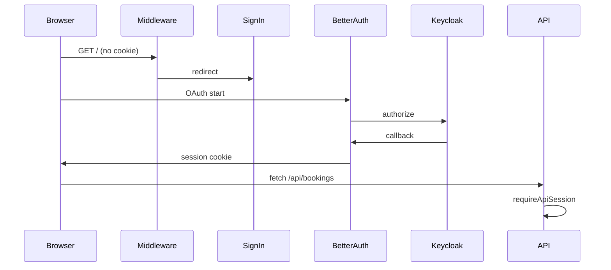

# Auth & sessions — agent reference

## Stack

- **Better Auth** + **better-sqlite3** → `data/auth.db`
- **Keycloak** Generic OAuth (`providerId`: `keycloak`)
- Issuer example: `https://keycloak.kshrd.app/realms/user-management`

## Request flow



## Key files

| File | Role |
|------|------|
| `lib/auth.ts` | Server Better Auth config, SQLite, Keycloak plugin |
| `lib/auth-client.ts` | Browser client + `genericOAuthClient()` |
| `app/api/auth/[...all]/route.ts` | Auth HTTP handler |
| `middleware.ts` | Redirect unauthenticated users to `/sign-in` |
| `app/sign-in/page.tsx` | Keycloak button |
| `lib/require-session.ts` | `requireApiSession()` for API routes |

## Env

See `.env.example`. Production/Docker: `BETTER_AUTH_URL` must match the URL users use in the browser (including port, e.g. `http://127.0.0.1:9999`).

## Authorization (bookings)

- APIs: authenticated session required
- UI edit/delete: `canManageBooking(booking, actorEmail, isAdmin)` in `lib/session-roles.ts`
- Admin: Keycloak role **`role_admin`** on session user

## Migrations

After changing Better Auth schema in `lib/auth.ts`:

```bash
npx @better-auth/cli@latest migrate --config lib/auth.ts --yes
```

Docker image runs this at build time; dev: run manually after schema edits.

## When changing auth

Update `lib/auth.ts`, `middleware.ts`, and **`README.md`** + **`AGENTS.md`** if redirect URIs or env vars change.
